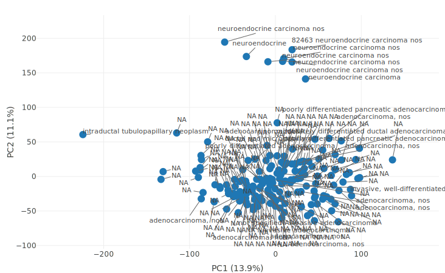

<h1>Analysis of RNA Seq data for Pancreatic Adenocarcinoma (PAAD)</h1> 
<h3>PCA plot of the whole data: </h3>

<h5><ul type="disc">
  <li>The plot above shows the clusters of samples based on their similarity. PC1 represents 13.9% (highest) of variabilty whereas PC2 represents 11.1% of variability betweeen the samples.</li>
  <li>Further, we can see that the neuroendocrine tumors and adenocarcinomas cluster into two separate cohorts</li>
  <li>And finally, the dataset containing only adenocarcinomas and no neuroendocrine tumor samples are retrieved (source code: Adenocarcinoma.ipynb)
  </ul>
  </h5>
  
  
  

